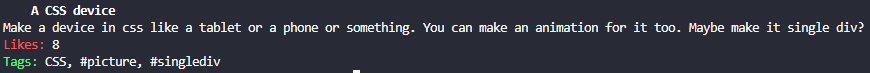

# what-to-code-cli
Get a random idea from https://what-to-code.com/



## Installation
```sh
$ go build what-to-code.go
# chmod +x what-to-code
# cp what-to-code /usr/bin
```

## Related
[what-to-code-cli](https://github.com/Guaxinim5573/what-to-code-cli) - Get a random idea from https://what-to-code.com/

## License
[MIT](LICENSE)